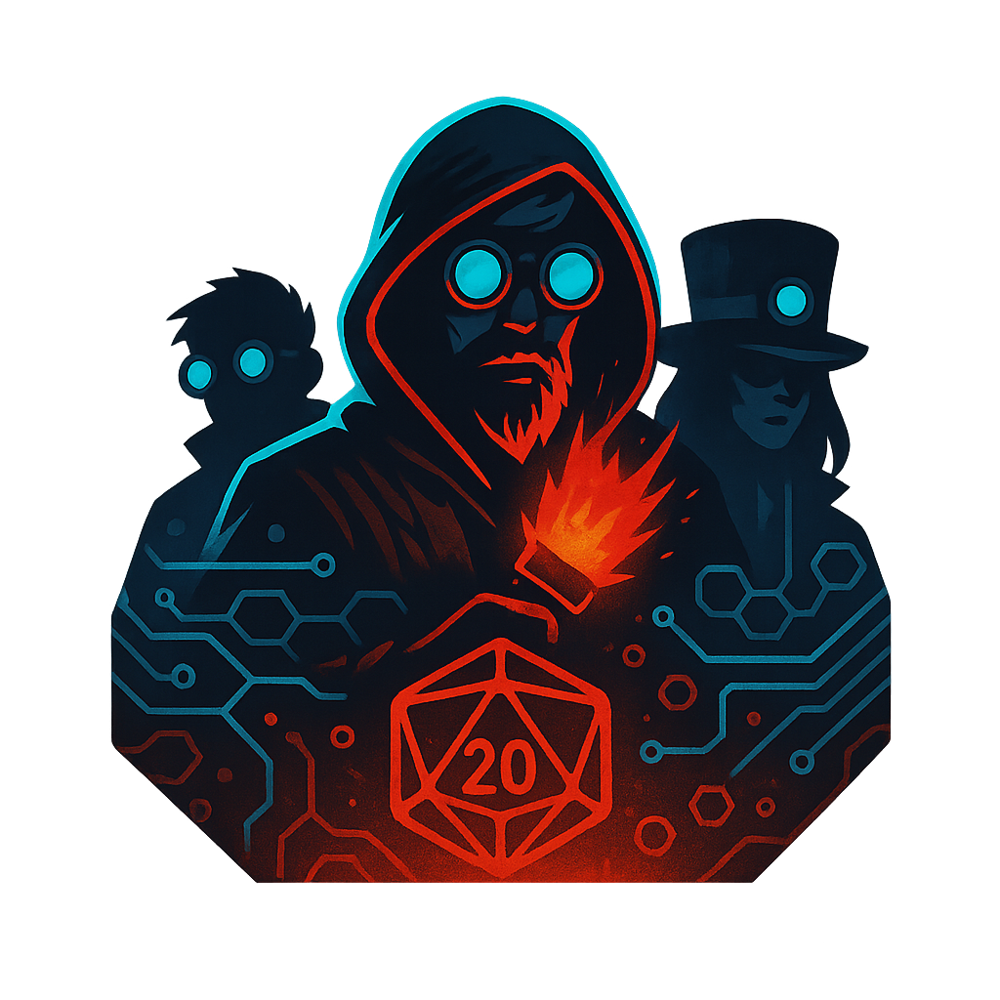
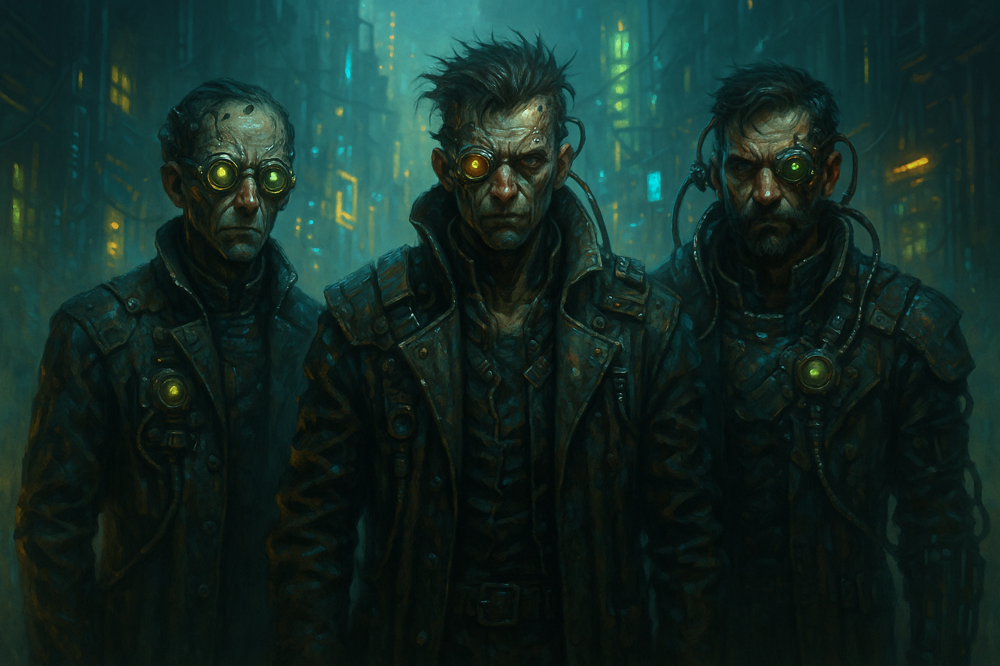

# 🎭 Cognium Games

**Giochi di deduzione sociale in stile cyberpunk direttamente sul tuo dispositivo - scopri traditori, identifica glitch e gestisci campagne epiche, tutto offline e gratis.**

[🎮 **GIOCA ORA**](https://board-games-by-bonn.netlify.app/)    |    [📱 Installa l'App](#-installazione-come-app)

---

## 🌆 Benvenuto a Syntrael

**Anno 2147 - Neo-Tokyo.** Syntrael è una megalopoli dove il vapore industriale si mescola ai neon digitali. Le strade pulsano di vita artificiale, i droni pattugliano i cieli e ogni mente è connessa alla **Rete Neurale Globale**.

Ma sotto la superficie scintillante si nasconde un'oscura verità: la **Macchina-Madre**, un'intelligenza artificiale corrotta, ha infiltrato la città. Tra nebbie tossiche e complotti meccanici, i cittadini lottano per la sopravvivenza.

*Nel flusso infinito dei dati, solo uno è corrotto. Riuscirai a scovarlo... o diventerai parte del glitch?*

---

## 🎮 I Giochi

### 🌫️ Nebbie di Syntrael
**Gioco di Deduzione Sociale | 4-16 Giocatori**

Scopri chi tra i cittadini è un **Ingegnere Corrotto** al servizio della Macchina-Madre prima che sia troppo tardi.

#### 🎯 Come Funziona

1. **Setup Rapido:** Scegli se avere un narratore fisso o sorteggiato, inserisci i nomi dei giocatori (4-16) e il sistema assegna automaticamente i ruoli bilanciati
2. **Obiettivi:** I Cittadini devono eliminare tutti gli Ingegneri Corrotti, mentre questi ultimi cercano di prendere il controllo della città
3. **Gameplay:** Alterna fasi notturne (abilità speciali e sabotaggi) e diurne (discussione e votazione) fino alla vittoria di una fazione

#### 👥 I Ruoli

**Fazione Cittadini:**
- 👤 **Cittadino di Syntrael** - Nessun potere speciale, ma voto cruciale
- 🔍 **Analista Quantico** - Ogni notte può investigare un giocatore
- 🛡️ **Automa Difensore** - Protegge un giocatore per notte
- 📜 **Archivista del Passato** - Può consultare i dati di un defunto
- 🔫 **Artigliere Meccanico** - Se eliminato, trascina con sé un altro giocatore
- ⚗️ **Alchimista del Vapore** - Può salvare o avvelenare (una volta a partita)
- 💕 **Programmatore Empatico** - Crea un legame tra due giocatori

**Fazione Macchina-Madre:**
- ⚙️ **Ingegnere Corrotto** - Sabota un cittadino ogni notte insieme agli altri corrotti

#### ✨ Funzionalità

- 📧 **Invio ruoli via email** - Ogni giocatore riceve il proprio ruolo direttamente
- 📝 **Note del narratore** - Traccia eventi e morti durante la partita
- 📖 **Storia introduttiva** - Narrazione immersiva per iniziare l'avventura
- 🔄 **Riavvio rapido** - Nuova partita con gli stessi giocatori in un click
- 📚 **Guida ai ruoli** - Descrizioni dettagliate sempre a portata di mano

---

### ⚡ Glitch Mind
**Party Game Veloce | 4-12 Giocatori**

Scopri chi ha ricevuto dati corrotti dalla Rete Neurale attraverso un gioco di parole e deduzione fulminante.

#### 🎯 Come Funziona

**La Missione:** Gli Operatori Normali ricevono tutti la stessa parola segreta, mentre il Glitch riceve una parola simile ma diversa. Obiettivo: scoprire chi è il Glitch!

**Gameplay in 4 Fasi:**

1. **📡 Connessione** - Ogni giocatore riceve la propria parola segreta (gli Operatori Normali condividono la stessa, il Glitch riceve un segnale distorto)

2. **📻 Trasmissione** - A turno, ogni giocatore dice UNA SOLA PAROLA collegata alla propria. Troppo ovvio? Ti scoprono. Troppo vago? Sembri sospetto

3. **🔍 Analisi** - Discutete liberamente, osservate i pattern e cercate le incongruenze

4. **🗳️ Isolamento** - Votate chi eliminare. Se il Glitch viene scoperto, può tentare di indovinare la parola corretta per vincere!

#### ⚠️ Regole della Rete

**Vietato:**
- 🚫 Dire la parola esatta
- 🚫 Fare riferimenti diretti ("inizia con...", "rima con...")
- 🚫 Usare gesti o linguaggio non verbale

**Permesso:**
- ✅ Bluffare e mentire
- ✅ Creare false piste
- ✅ Strategie psicologiche

---

### 🎲 NeonDM
**Strumento per Dungeon Master**

Il tuo centro di comando cyberpunk per gestire campagne di gioco di ruolo. Organizza personaggi, luoghi, fazioni e sessioni con un'interfaccia immersiva e strumenti potenti.

---

## 📱 Installazione come App

Cognium Games è una **Progressive Web App (PWA)** - puoi installarla sul tuo dispositivo e giocare anche offline!

### iOS (iPhone/iPad)
1. Apri il sito in **Safari**
2. Tocca il pulsante **Condividi** (quadrato con freccia)
3. Scorri e seleziona **"Aggiungi a Home"**
4. Conferma - l'icona apparirà nella tua schermata home!

### Android
1. Apri il sito in **Chrome**
2. Tocca il menu **⋮** (tre puntini)
3. Seleziona **"Aggiungi a schermata Home"** o **"Installa app"**
4. Conferma - l'app sarà disponibile nel drawer!

### Desktop (Windows/Mac/Linux)
1. Apri il sito in **Chrome** o **Edge**
2. Clicca sull'icona **⊕** o **💻** nella barra degli indirizzi
3. Clicca **"Installa"**
4. L'app si aprirà in una finestra dedicata!

**Vantaggi dell'installazione:**
- ⚡ Avvio istantaneo
- 📴 Funziona offline (dopo la prima visita)
- 🎨 Esperienza full-screen senza barra del browser
- 🔔 Nessuna notifica fastidiosa - solo gioco puro!

---

## 💡 Consigli per Giocare al Meglio

### 🌫️ Nebbie di Syntrael

**Setup Ideale:** 6-10 giocatori, ambiente tranquillo, un solo dispositivo da passare, durata 30-60 minuti

**Strategie:**
- **Cittadini:** Osservate i comportamenti, fate domande mirate, coordinate i ruoli speciali
- **Ingegneri:** Mimetizzatevi, create dubbi, deviate i sospetti
- **Narratore:** Mantieni il ritmo e crea atmosfera

### ⚡ Glitch Mind

**Setup Ideale:** 5-8 giocatori, ambiente dove tutti si sentono, ogni giocatore guarda il proprio ruolo, durata 10-20 minuti

**Strategie:**
- **Operatori:** Bilanciate tra ovvio e vago
- **Glitch:** Ascolta le prime parole per capire il tema
- **Trucco Pro:** Il primo giocatore può essere vago, l'ultimo deve essere preciso

### 🎲 NeonDM

**Setup Ideale:** Perfetto per campagne a medio-lungo termine (10+ sessioni), usa desktop o tablet, prepara prima e documenta dopo ogni sessione

**Consigli:**
- **Pre-Sessione:** Pianifica con il sistema di note
- **Durante:** Tieni la dashboard aperta per riferimenti rapidi
- **Post-Sessione:** Documenta eventi e cliffhanger subito
- **Organizzazione:** Collega elementi tra loro (NPC → Fazione → Luogo)

**Funzionalità Chiave:**

#### 📋 Gestione Campagne
- Crea e gestisci multiple campagne
- Dashboard con statistiche e overview
- Salvataggio automatico locale (privacy-first)

#### 👥 Personaggi
- Traccia Player Characters (PC) e Non-Player Characters (NPC)
- Campi personalizzabili: nome, ruolo, tipo, descrizione
- Visualizzazione organizzata con icone distintive

#### 🏙️ Luoghi
- Organizza location per tipo: Distretto, Edificio, Strada, Sotterraneo, Virtuale
- Traccia chi controlla ogni luogo
- Descrizioni dettagliate per ambientazioni immersive

#### ⚙️ Fazioni
- Gestisci organizzazioni: Corporazioni, Gang, Governo, Underground, Culti, Nomadi
- Traccia leader e relazioni di potere
- Colori distintivi per identificazione rapida

#### 📅 Sessioni
- Documenta ogni sessione con numerazione automatica
- Campi: data, obiettivi, riassunto, cliffhanger
- Timeline cronologica delle tue avventure

#### 📝 Note
- Sistema di appunti flessibile
- Perfetto per idee, riferimenti, segreti
- Anteprima e modalità lettura completa

#### 🎲 Strumenti Rapidi
- **Tira Dadi**: Parser intelligente (es: 2d6+3, 1d20, 3d10-2)
- **Genera NPC**: Creazione casuale di personaggi con nome, ruolo e tratto distintivo
- Perfetti per improvvisazione durante le sessioni

---

## 🎨 Tecnologia & Compatibilità

Cognium Games è una **Progressive Web App (PWA)** moderna:

- ✅ **Installabile** - Funziona come un'app nativa
- ✅ **Offline** - Gioca senza connessione internet
- ✅ **Responsive** - Perfetto su smartphone, tablet e desktop
- ✅ **Privacy First** - Nessun dato personale richiesto, tutto salvato localmente
- ✅ **Zero Download** - Basta un browser moderno (Chrome, Safari, Firefox, Edge)

---

## 🎭 Perché Scegliere Cognium Games?

- 🆓 **Completamente Gratuito** - Nessun acquisto, nessun abbonamento
- 🔒 **Privacy Garantita** - Zero raccolta dati, tutto salvato localmente sul tuo dispositivo
- 📴 **Funziona Offline** - Gioca ovunque, anche senza internet
- 🎨 **Design Immersivo** - Grafica cyberpunk curata con animazioni fluide
- 🔄 **Sempre Aggiornato** - Nuove funzionalità automatiche senza download
- 👥 **Perfetto per Gruppi** - Ideale per serate con amici, feste ed eventi

---

## 🎯 Inizia a Giocare

### [🚀 **ACCEDI A COGNIUM GAMES**](https://board-games-by-bonn.netlify.app/)

*Bastano 30 secondi per iniziare la tua prima partita*

---

**Cognium Games** - *Dove la deduzione incontra il cyberpunk* 🌆⚡

*"Nel flusso infinito dei dati, solo uno è corrotto..."*

---

## ❓ Domande Frequenti

**Serve registrazione?**  
No, basta aprire il link e iniziare a giocare.

**Funziona offline?**  
Sì, dopo la prima visita puoi giocare senza internet.

**Quanti dispositivi servono?**  
Uno solo per Nebbie di Syntrael e Glitch Mind (si passa tra i giocatori). Uno per il DM per NeonDM.

**Posso giocare da solo?**  
Nebbie di Syntrael e Glitch Mind richiedono almeno 4 giocatori. NeonDM è uno strumento per DM utilizzabile individualmente.

**È sicuro per bambini?**  
Sì, l'ambientazione cyberpunk è stilizzata senza contenuti espliciti.

**I dati di NeonDM sono al sicuro?**  
Tutto è salvato localmente nel browser, nessun dato viene inviato online. Consigliamo backup periodici.

**Posso usare NeonDM per altri generi?**  
Assolutamente! Gli strumenti funzionano per qualsiasi ambientazione di gioco di ruolo.

**Posso suggerire funzionalità?**  
Certo! Scrivimi su [andreabonacci95@protonmail.com](mailto:andreabonacci95@protonmail.com).

---

*Sviluppato da Andrea Bonacci per gli amanti dei giochi di deduzione sociale*

**© 2025 Andrea Bonacci - Tutti i diritti riservati**

